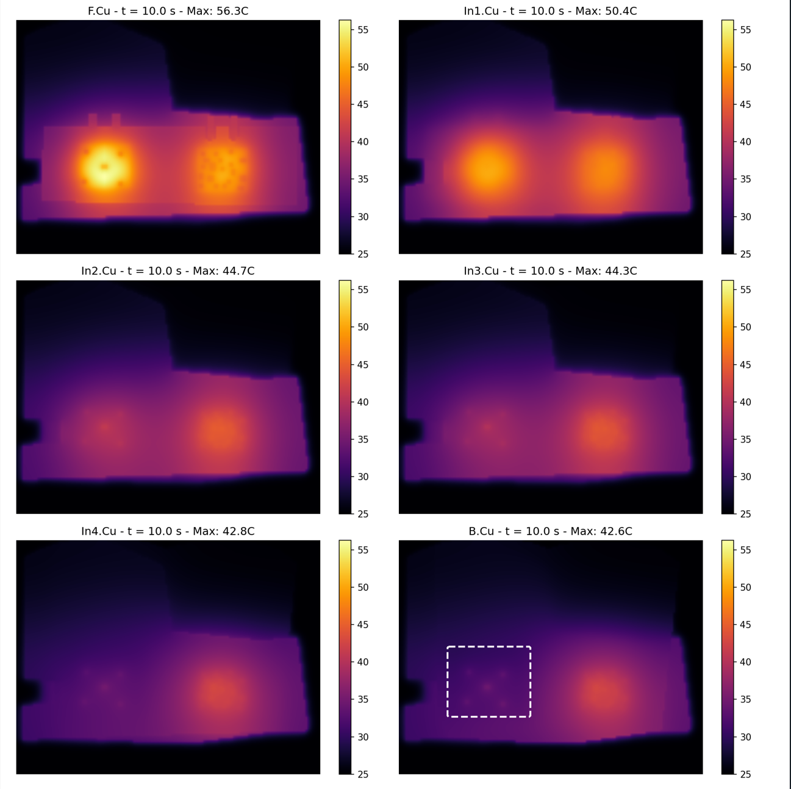
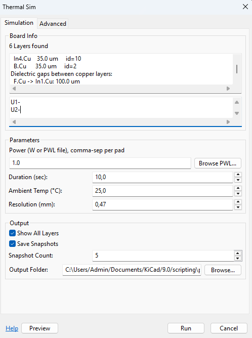
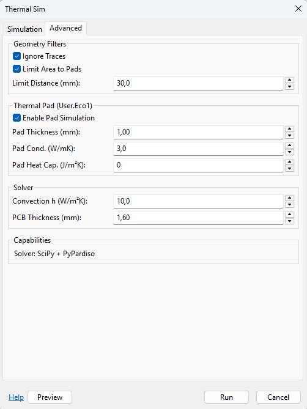
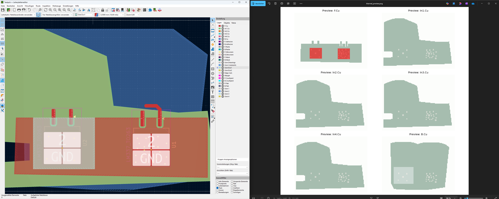

# KiCad Thermal Sim — Fast Multi-Layer Copper Thermal Simulation for KiCad



**KiCad Thermal Sim** is a lightweight KiCad PCB Editor plugin that performs a fast, layout-oriented **heat spreading simulation across all copper layers** (F.Cu…B.Cu including inner layers).

This is **not** a full 3D CFD/FEA solver. It is intended as a practical engineering tool to quickly answer:

- Where are the **hotspots** on each copper layer?
- How much do **copper pours/planes** and **via stitching** help?
- Which layout variant is **better** (A/B comparison)?
- How does heat distribute through the **stackup**?

---

## What it simulates (high level)

- **2D in-plane conduction** on each copper layer (heat spreading within a layer)
- **Vertical coupling** between adjacent copper layers (FR4 conduction + via enhancement)
- **Power injection** from selected pads (constant or **time-varying PWL profiles**)
- **Convection** to ambient on the **top and bottom** outer surfaces
- Optional: a **Thermal Pad zone** on `User.Eco1` used as an area with stronger bottom-side heat removal

---

## Installation

### Option A: KiCad Plugin Manager (recommended)

1. Download the latest `ThermalSim-vX.Y.Z.zip` from the [Releases](https://github.com/PoeAlex/KiCad_Thermal_Sim/releases) page.
2. In KiCad, open **Plugin and Content Manager**.
3. Click **Install from File…** and select the downloaded ZIP.
4. Restart KiCad.
5. On first run, the plugin will detect missing dependencies and offer to install them automatically.

### Option B: Manual copy

1. Download or clone this repository.
2. Copy the `ThermalSim` folder into KiCad's plugin directory:

   - **Windows**: `%APPDATA%\kicad\9.0\scripting\plugins\`
   - **Linux**: `~/.local/share/kicad/9.0/scripting/plugins/`
   - **macOS**: `~/Library/Application Support/kicad/9.0/scripting/plugins/`

3. Restart KiCad.
4. On first run, the plugin will offer to install missing packages (`numpy`, `scipy`, `matplotlib`) automatically. Alternatively, install them manually in the **KiCad 9.0 Command Prompt**:
   ```
   pip install numpy scipy matplotlib
   ```
   Optional for faster solves: `pip install pypardiso` (Intel MKL sparse solver)

5. In PCB Editor, run via **Tools → External Plugins → 2.5D Thermal Sim**.

### Auto-Dependency Installation

If required packages are missing, the plugin automatically shows an install dialog instead of crashing. The dialog runs `pip install` in the background and streams the output. After installation, restart KiCad.

---

### PCM installation (Install from file…)
To install via KiCad’s Plugin and Content Manager (PCM), create a ZIP from the contents of the `pcm_package/` folder (do **not** run these commands here; they are provided as examples only).

**Important:** “The ZIP must contain plugins/, (optional) resources/, and metadata.json at the archive root (no extra top-level folder).”

**Windows (PowerShell)**:
```powershell
Compress-Archive -Path pcm_package\* -DestinationPath KiCad_Thermal_Sim-PCM.zip
```

**Linux/macOS**:
```sh
cd pcm_package
zip -r ../KiCad_Thermal_Sim-PCM.zip .
```

Then open KiCad → **Plugin and Content Manager** → **Install from file…** and select the ZIP.

---

## Quick start

1. Open your PCB in **KiCad PCB Editor**.
2. Select one or multiple **pads** that represent your heat sources.
3. Run the plugin via **Tools → External Plugins → 2.5D Thermal Sim**.
4. Set **Power** (constant value or PWL file path), **Duration**, **Ambient**, and **Resolution**.
5. (Optional) Switch to the **Advanced** tab for geometry filters, thermal pad, and solver settings.
6. Click **Preview** (sanity check), then **Run**.





---

## GUI settings

The dialog has two tabs: **Simulation** (main parameters) and **Advanced** (geometry filters, thermal pad, solver).

### Simulation tab

#### Board Info
Shows detected copper layers with thicknesses and dielectric gaps parsed from the board stackup. Selected heat-source pads are listed below.

#### Power (W or PWL file path)
Power assigned to each selected pad. The field accepts:

| Entry | Meaning |
|-------|---------|
| `1.0` | 1 W constant on every selected pad |
| `1.0, 0.5, 2.0` | Per-pad constant power (comma-separated) |
| `C:\sim\ramp.pwl` | Same PWL profile for all pads |
| `1.0, C:\sim\ramp.pwl` | Pad 1 = 1 W constant, Pad 2 = PWL file |

Use the **Browse PWL...** button to pick a file. Clicking it multiple times appends paths for each pad.

**PWL file format** (LTspice-compatible):
```
; Comment lines start with ; or *
; Time(s)  Power(W)
0.0        0.0
0.001      1.0
0.005      2.5
0.010      2.5
0.020      0.0
```
- Two whitespace-separated columns: time (seconds), power (watts)
- Time values must be monotonically increasing
- Linear interpolation between breakpoints; holds first/last value outside range

#### Duration (sec)
Total simulated time. Shorter durations emphasize transient peaks; longer durations approach quasi steady-state.

#### Ambient Temp (°C)
Reference temperature. All results are relative to ambient.

#### Resolution (mm)
Spatial discretization step size. Smaller (0.2–0.5 mm) gives better hotspot localization but is slower. Larger (0.8–1.5 mm) is faster but smears peaks.

#### Output
- **Show All Layers** — display results for all copper layers (stackup view)
- **Save Snapshots** — store intermediate time-step images
- **Snapshot Count** — number of intermediate snapshots
- **Output Folder** — where results are saved

### Advanced tab

#### Geometry Filters
- **Ignore Traces** — exclude copper traces from the conductivity map (zones/pours/pads still contribute)
- **Limit Area to Pads** — restrict simulation domain to an area around selected pads (major speedup on large boards)
- **Limit Distance (mm)** — radius around pads when area limiting is enabled (practical starting point: 20–40 mm)

#### Thermal Pad (User.Eco1)
- **Enable Pad Simulation** — treat `User.Eco1` geometry as a thermal interface zone with enhanced bottom-side heat removal
- **Pad Thickness (mm)** — TIM thickness (thicker = higher resistance)
- **Pad Cond. (W/mK)** — TIM thermal conductivity
- **Pad Heat Cap. (J/m²K)** — additional thermal capacitance of the thermal pad

#### Solver
- **Convection h (W/m²K)** — convection coefficient for top/bottom surfaces (default: 10)
- **PCB Thickness (mm)** — overall board thickness (auto-detected from stackup if available)

#### Capabilities
Shows detected solver backend (SciPy, PyPardiso).

---

## Preview

The **Preview** button generates a geometry visualization showing copper distribution, pad locations, and via regions on each layer — useful for verifying the simulation setup before running.



---

## How to interpret results

This tool is most reliable for:
- **Relative comparisons** (layout A vs layout B)
- **Hotspot locations**
- Trends: more copper, more vias, better spreading

Absolute temperatures are **estimates** and depend on modeling assumptions.

---

## Architecture

The plugin is split into focused modules:

| Module | Purpose |
|--------|---------|
| `capabilities.py` | Runtime detection of numpy, scipy, matplotlib, pypardiso, numba |
| `dependency_installer.py` | Auto-install dialog for missing packages via pip |
| `stackup_parser.py` | Parse copper/dielectric layers from .kicad_pcb S-expressions |
| `gui_dialogs.py` | wxPython dialog for simulation parameters (tabbed UI) |
| `geometry_mapper.py` | Convert PCB geometry to discretized conductivity arrays |
| `thermal_solver.py` | Sparse matrix assembly, BDF2 time integration |
| `pwl_parser.py` | Parse LTspice-style PWL power profiles |
| `visualization.py` | Generate thermal plots and preview images |
| `thermal_report.py` | Generate HTML summary report |
| `thermal_plugin.py` | Orchestrate workflow, KiCad ActionPlugin interface |

---


## Limitations

- No component/package thermal model (junction → case → pad is not explicitly modeled)
- Convection is simplified (uniform top/bottom ambient coupling; no airflow field)
- Radiation is not modeled
- Via coupling is an approximation (via density enhancement heuristic)
- Results depend strongly on **Resolution (mm)** and (if used) **Limit Area/Distance**
- Thermal Pad (User.Eco1) is a simplification of real mechanical contact pressure, interface quality, and sink temperature

---

## Suggested workflow

1. Start with **Limit Area to Pads** enabled and a moderate **Limit Distance** (e.g., 30 mm).
2. Tune **Resolution** until hotspots are stable (try 0.5 mm then 0.3 mm).
3. Compare layout variants using the same settings.
4. Only enable **Thermal Pad (User.Eco1)** if you have a real bottom-side interface in the product.

---

## License / Disclaimer

MIT License

This plugin provides engineering estimates intended for fast iteration and comparative analysis.
For safety-critical or thermally constrained designs, validate with measurement and/or a full 3D thermal tool.
