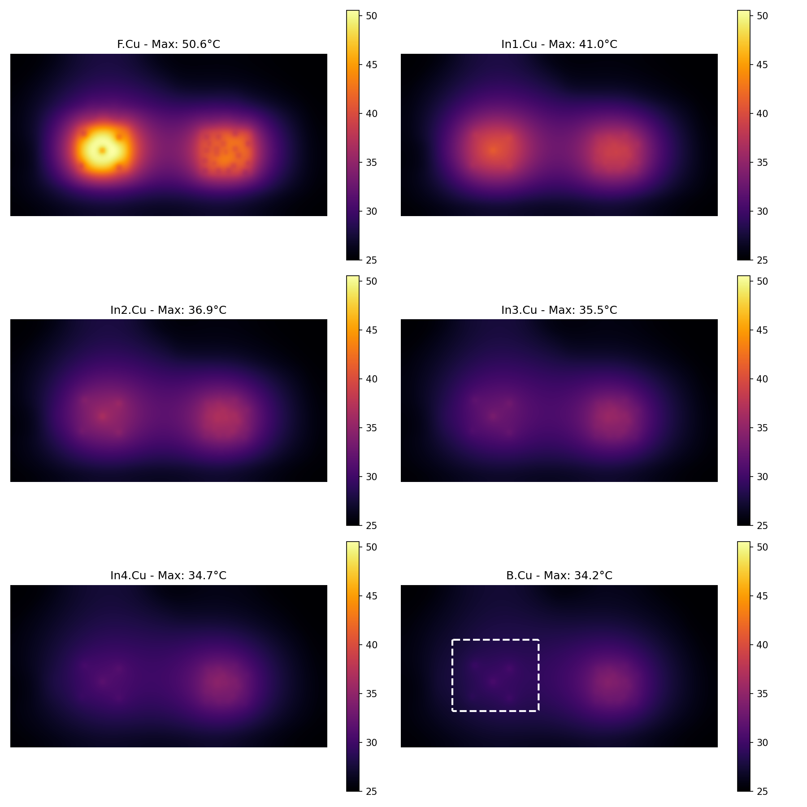
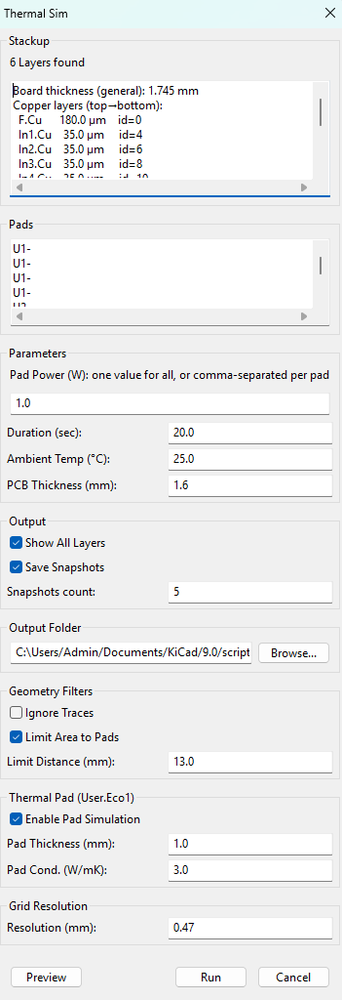

# KiCad Thermal Sim — Fast Multi-Layer Copper Thermal Estimator for KiCad

**KiCad Thermal Sim** is a lightweight KiCad PCB Editor plugin that performs a fast, layout-oriented **heat spreading simulation across all copper layers** (F.Cu…B.Cu including inner layers).

This is **not** a full 3D CFD/FEA solver. It is intended as a practical engineering tool to quickly answer:

- Where are the **hotspots** on each copper layer?
- How much do **copper pours/planes** and **via stitching** help?
- Which layout variant is **better** (A/B comparison)?
- How does heat distribute through the **stackup**?

---

## What it simulates (high level)

- **2D in-plane conduction** on each copper layer (heat spreading within a layer)
- **Vertical coupling** between adjacent copper layers (FR4 conduction + via enhancement)
- **Power injection** from selected pads (power distributed over raster cells)
- **Convection** to ambient on the **top and bottom** outer surfaces
- Optional: a **Thermal Pad zone** on `User.Eco1` used as an area with stronger bottom-side heat removal

---

## Installation

### Recommended: Copy into KiCad’s scripting/plugins directory
1. Download or clone this repository.
2. Copy the plugin folder (containing `__init__.py` and the main script) into KiCad’s plugin directory:

Typical paths:
- **Windows**: `%APPDATA%\kicad\9.0\scripting\plugins\`
- **Linux**: `~/.local/share/kicad/9.0/scripting/plugins/`
- **macOS**: `~/Library/Application Support/kicad/9.0/scripting/plugins/`

3. ***Install Matplotlib and scipy!*** Open Kicad 9.0 Command Prompt and type in "pip install matplotlib" and "pip install scipy".
4. Restart KiCad.
5. In PCB Editor, run it via **Tools → External Plugins** (or the plugin menu, depending on KiCad version).

---

## Quick start

1. Open your PCB in **KiCad PCB Editor**.
2. Select one or multiple **pads** that represent your heat sources.
3. Run the plugin.
4. Set **Total Power**, **Duration**, **Ambient**, and **Resolution**.
5. (Optional) enable geometry filters and/or the thermal pad zone.
6. Click **Preview** (sanity check), then **Run**.

---

## GUI settings (exactly as in the plugin)

Below is a 1:1 explanation of the options visible in the current GUI.

### Stackup
**“N Layers found (F.Cu…B.Cu)”**  
Informational. Shows how many copper layers were detected and that the tool will simulate from top to bottom.

---

## Parameters

### Total Power (W) for N Pad(s)
Total dissipated power assigned to the **currently selected pads**. E.g. if 1W means 1W on each selcted pad.

**Impact**
- Temperature rise scales approximately linearly with power.
- If you select many pads, the same total power is spread across a larger area → lower peak temperature.

---

### Duration (sec)
Total simulated time.

**Impact**
- Shorter durations emphasize transient peaks close to the heat source.
- Longer durations move the board toward a quasi steady-state (depending on convection).

---

### Ambient Temp (°C)
Ambient reference temperature.

**Impact**
- All results are relative to ambient; increasing ambient shifts the whole temperature field upward.

---

### PCB Thickness (mm)
Overall board thickness used in the model (affects vertical coupling and thermal mass assumptions).

**Impact**
- Thicker boards generally reduce short-term temperature rise (more thermal mass),
  and change vertical conduction characteristics between layers.

---

## Output

### Show All Layers
If enabled, the plugin displays results for **all copper layers**.

**Impact**
- More comprehensive visualization (stackup view).
- Slightly more plotting overhead.

---

### Save Snapshots
If enabled, the plugin stores additional images during/after the run (depending on implementation).

**Impact**
- Useful for documentation and comparing iterations.
- Increases runtime and creates more output files.

---

## Geometry Filters

### Ignore Traces
Excludes copper traces from the conductivity map (zones/pours/pads still contribute).

**Impact**
- Faster mapping and often slightly more conservative if traces are thin.
- Disable this if traces are an important heat spreading path in your design.

---

### Limit Area to Pads
Restricts the simulation domain to an area around the selected pads.

**Impact**
- Major speedup on large boards.
- If the limited area is too small, you cut off real heat spreading paths and may underestimate
  spreading and steady-state behavior.

---

### Limit Distance (mm)
Only active when **Limit Area to Pads** is enabled. Sets the radius/extent around the selected pads.

**Impact**
- Larger distance → more accurate global spreading, slower.
- Smaller distance → faster, but can underpredict spreading.

Practical starting point: **20–40 mm**, then increase if results look “boxed in”.

---

## Thermal Pad (User.Eco1)

### Enable Pad Simulation
Enables a bottom-side enhanced cooling/thermal interface zone derived from geometry on **`User.Eco1`**.

**How it works**
- Any area on `User.Eco1` is treated as a “thermal pad contact region” that increases heat removal
  at the bottom surface in those pixels.

**Impact**
- Useful to approximate contact to a chassis/heatsink/thermal pad under the PCB.
- If enabled without matching real mechanics, it can make results overly optimistic.

---

### Pad Thickness (mm)
Thickness of the thermal interface material (TIM) / pad.

**Impact**
- Thicker pad → higher thermal resistance → less heat removal (board runs hotter).
- Thinner pad → lower thermal resistance → more heat removal.

---

### Pad Cond. (W/mK)
Thermal conductivity of the pad/TIM material.

**Impact**
- Higher conductivity → better heat removal (cooler board).
- Lower conductivity → worse heat removal (hotter board).

Typical TIM pads vary widely (order of magnitude). Use datasheet values if available.

---

## Grid Resolution

### Resolution (mm)
Spatial discretization step size (grid cell size).

**Impact**
- Smaller resolution (e.g., 0.2–0.5 mm) → better hotspot localization, slower.
- Larger resolution (e.g., 0.8–1.5 mm) → faster, but power is smeared across fewer cells → peaks can be lower.

---

## Buttons

### Preview
Runs a quick pre-check and visualization to confirm:
- pad selection was detected
- domain limiting behaves as expected
- thermal pad zone (User.Eco1) is being found (if enabled)

### Run
Executes the simulation.

### Cancel
Closes the dialog.

---

## How to interpret results

This tool is most reliable for:
- **Relative comparisons** (layout A vs layout B)
- **Hotspot locations**
- Trends: more copper, more vias, better spreading

Absolute temperatures are **estimates** and depend on modeling assumptions.

---

## Limitations

- No component/package thermal model (junction → case → pad is not explicitly modeled)
- Convection is simplified (uniform top/bottom ambient coupling; no airflow field)
- Radiation is not modeled
- Via coupling is an approximation (via density enhancement heuristic)
- Results depend strongly on **Resolution (mm)** and (if used) **Limit Area/Distance**
- Thermal Pad (User.Eco1) is a simplification of real mechanical contact pressure, interface quality, and sink temperature

---

## Suggested workflow

1. Start with **Limit Area to Pads** enabled and a moderate **Limit Distance** (e.g., 30 mm).
2. Tune **Resolution** until hotspots are stable (try 0.5 mm then 0.3 mm).
3. Compare layout variants using the same settings.
4. Only enable **Thermal Pad (User.Eco1)** if you have a real bottom-side interface in the product.

---

## License / Disclaimer

MIT License

This plugin provides engineering estimates intended for fast iteration and comparative analysis.
For safety-critical or thermally constrained designs, validate with measurement and/or a full 3D thermal tool.
