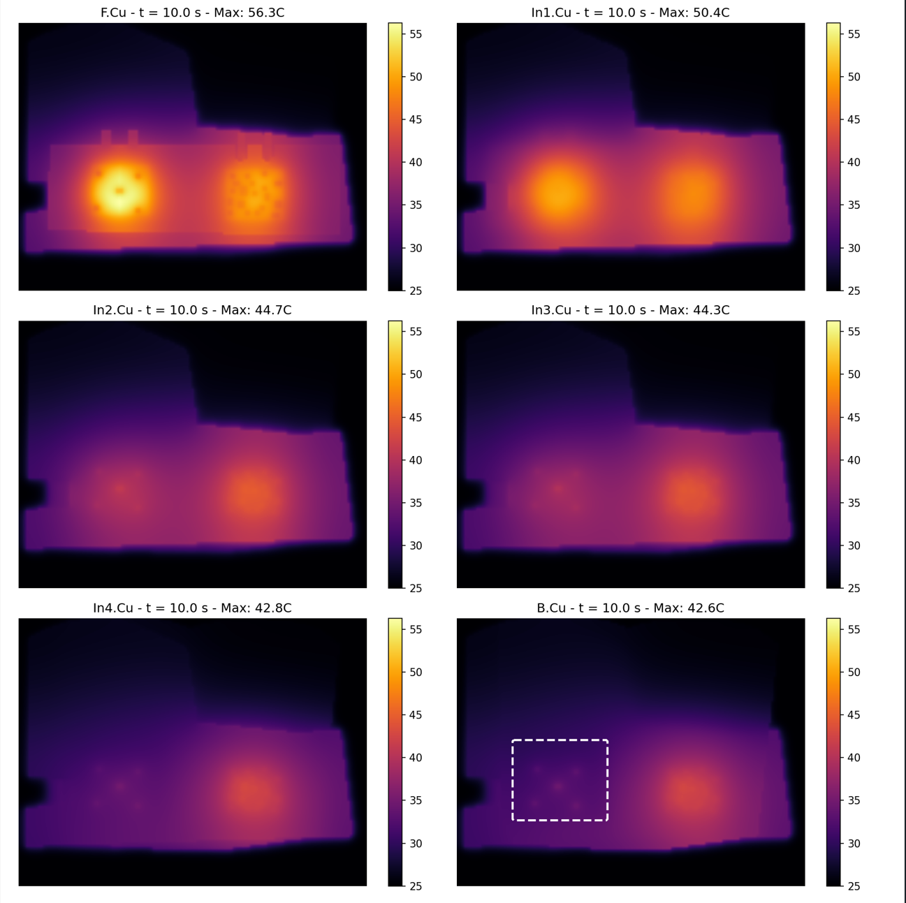
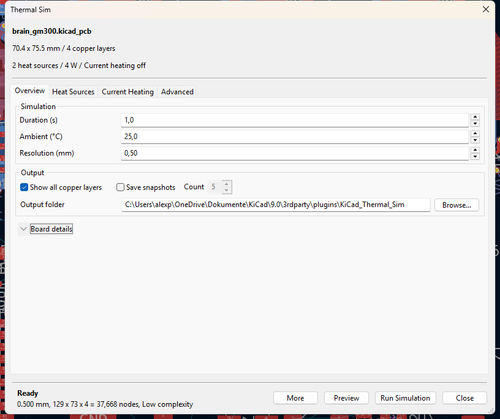
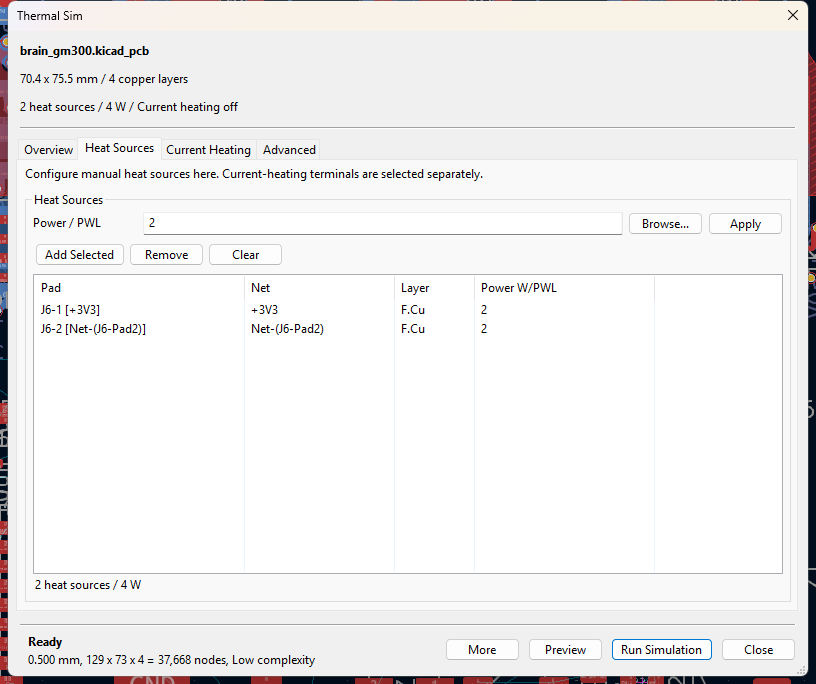
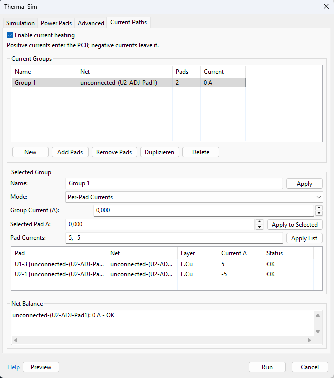
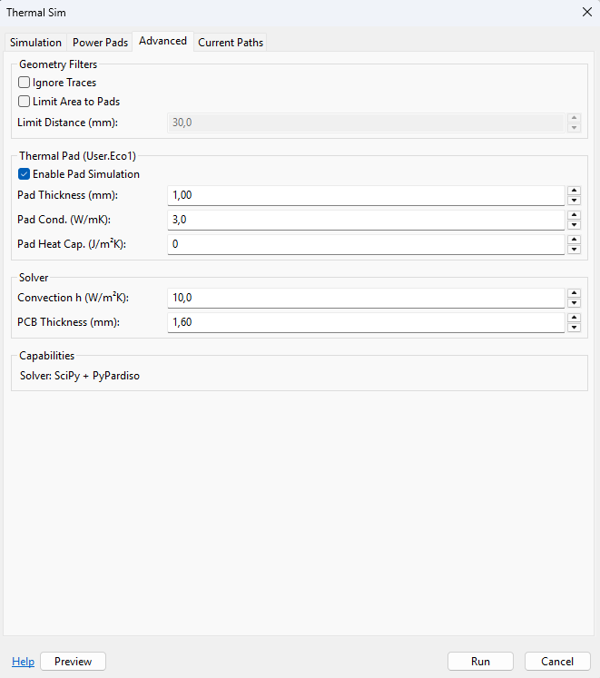
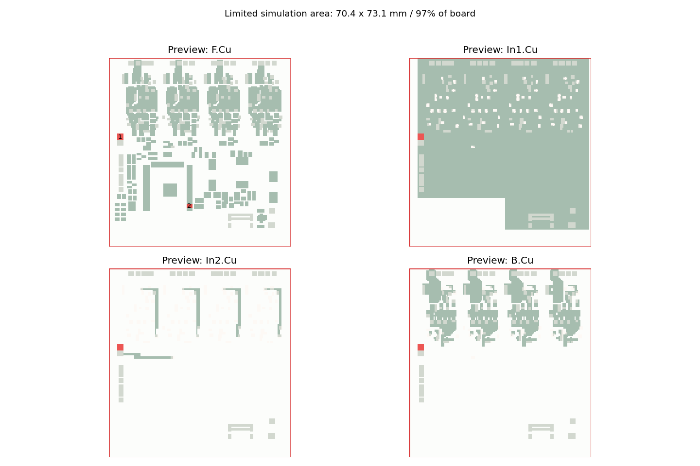

# KiCad Thermal Sim - Fast Multi-Layer Copper Thermal Simulation for KiCad



**KiCad Thermal Sim** is a lightweight KiCad PCB Editor plugin for fast, layout-oriented **heat spreading simulation across all copper layers** (`F.Cu` to `B.Cu`, including inner layers).

This is **not** a full 3D CFD/FEA solver. It is intended as a practical engineering tool to quickly answer:

- Where are the **hotspots** on each copper layer?
- How much do **copper pours/planes** and **via stitching** help?
- Which layout variant is **better** in an A/B comparison?
- How does heat distribute through the **stackup**?
- How much extra heat is created by **DC current flow** in copper?
- Which grid settings were actually used when automatic coarsening protects runtime?

---

## What It Simulates

- **2D in-plane conduction** on each copper layer.
- **Vertical coupling** between adjacent copper layers through FR4 and via enhancement.
- **Manual power injection** from explicitly configured **Power Pads**.
- Constant pad power and time-varying **PWL power profiles**.
- Optional **DC current-flow heating** from source/sink pads on KiCad nets.
- **Convection** to ambient on top and bottom outer surfaces.
- Optional **Thermal Pad** geometry on `User.Eco1` for stronger bottom-side heat removal.
- Current-path diagnostics: copper loss, effective resistance, equivalent voltage drop, grid quality, and a Joule loss map.

---

## Installation

### Option A: KiCad Plugin Manager

1. Download the latest `ThermalSim-vX.Y.Z.zip` from the [Releases](https://github.com/PoeAlex/KiCad_Thermal_Sim/releases) page.
2. In KiCad, open **Plugin and Content Manager**.
3. Click **Install from File...** and select the downloaded ZIP.
4. Restart KiCad.
5. On first run, the plugin detects missing dependencies and offers to install them automatically.

### Option B: Manual Copy

1. Download or clone this repository.
2. Copy the plugin folder, meaning the folder that contains `__init__.py`, `thermal_plugin.py`, and the other `.py` modules, into KiCad's plugin directory:

   - **Windows**: `%APPDATA%\kicad\9.0\scripting\plugins\`
   - **Linux**: `~/.local/share/kicad/9.0/scripting/plugins/`
   - **macOS**: `~/Library/Application Support/kicad/9.0/scripting/plugins/`

3. Restart KiCad.
4. On first run, the plugin offers to install missing packages (`numpy`, `scipy`, `matplotlib`) automatically.

Alternatively, install packages manually in the **KiCad 9.0 Command Prompt**:

```bash
pip install numpy scipy matplotlib
```

Optional for faster large solves on supported Windows/Linux x86_64 systems:

```bash
pip install pypardiso
```

Run the plugin in PCB Editor via **Tools -> External Plugins -> 2.5D Thermal Sim**.

---

## Quick Start

1. Open your PCB in **KiCad PCB Editor**.
2. Select one or more pads if you want to pre-fill manual heat sources.
3. Run **Tools -> External Plugins -> 2.5D Thermal Sim**.
4. Use **Power Pads** to add pads that dissipate manual power, then enter constant W values or PWL file paths.
5. Set **Duration**, **Ambient**, and **Resolution** on the **Simulation** tab.
6. Optionally use **Current Paths** to add source/sink pads and per-pad currents for copper `I^2R` heating.
7. Optionally use **Advanced** for geometry filters, thermal pad, convection, solver settings, and expert grid limits.
8. Click **Preview** to check the mapped geometry, then **Run**.









---

## GUI Settings

The dialog has four tabs:

- **Simulation** - board/stackup info, duration, ambient temperature, resolution, and output settings.
- **Power Pads** - manual heat sources selected independently from current terminals.
- **Advanced** - geometry filters, thermal pad, convection, and solver settings.
- **Current Paths** - DC current source/sink terminals for Joule heating.

### Simulation Tab

#### Board Info

Shows detected copper layers with thicknesses and dielectric gaps parsed from the board stackup. Pads selected when the dialog opened are shown only as a convenience; simulation roles are configured in **Power Pads** and **Current Paths**.

#### Main Settings

- **Duration (sec)** - total simulated time. Shorter durations emphasize transient peaks; longer durations approach quasi steady-state.
- **Ambient Temp (C)** - reference temperature. Results are relative to ambient.
- **Resolution (mm)** - spatial grid cell size. Smaller values improve hotspot and trace localization but increase runtime.

For large boards, ThermalSim may automatically coarsen the requested resolution to keep the grid size practical. The report always records both the requested and actual solver resolution.

#### Output

- **Show All Layers** - display results for all copper layers.
- **Save Snapshots** - store intermediate temperature images.
- **Snapshot Count** - number of intermediate snapshots.
- **Output Folder** - where the timestamped result folder is created.

#### Settings Files

- **Load Settings...** - load a JSON settings file from any folder and apply it to the open dialog.
- **Save Settings...** - save the current dialog values as a JSON settings file.

ThermalSim also keeps using `thermal_sim_last_settings.json` in the plugin folder for automatic last-used settings. Manual load/save files use the same JSON structure and can be stored per project or per experiment.

### Power Pads Tab

Manual pad power is configured separately from current-flow terminals.

1. Select pads in KiCad.
2. Click **Add Selected Pads**.
3. Enter a power value or PWL file path in **Power W/PWL**.
4. Use **Apply to Selected** to write the value to selected table rows. If no row is selected, it applies to all power pads.
5. Use **Apply List** for comma-separated values in table order.

The Power Pads table is:

| Column | Meaning |
|--------|---------|
| Pad | Footprint/pad name |
| Net | KiCad net name |
| Layer | Pad layer |
| Power W/PWL | Constant W value or PWL file path |

Accepted power entries:

| Entry | Meaning |
|-------|---------|
| `1.0` | 1 W constant on selected/listed power pads |
| `1.0, 0.5, 2.0` | Per-pad constant power in table order |
| `C:\sim\ramp.pwl` | Same PWL profile for selected/listed pads |
| `1.0, C:\sim\ramp.pwl` | Pad 1 = 1 W constant, Pad 2 = PWL file |

For backward compatibility, pads selected before opening the dialog pre-fill the Power Pads table when no saved `power_pads` setting exists.

#### PWL File Format

PWL files are LTspice-style text files with two columns:

```text
; Comment lines start with ; or *
; Time(s)  Power(W)
0.0        0.0
0.001      1.0
0.005      2.5
0.010      2.5
0.020      0.0
```

- Time is in seconds.
- Power is in watts.
- Time values must be monotonically increasing.
- Power is linearly interpolated between points and held at the first/last value outside the defined range.

### Current Paths Tab

Enable current heating to calculate copper losses from DC current flow.

1. Select source/sink pads in KiCad.
2. Add them to a current group.
3. Enter positive current for source pads and negative current for sink pads.
4. Make sure every active KiCad net balances to `0 A`.

Current heating is additive with **Power Pads**:

```text
total heat = manual pad power + calculated Joule copper loss
```

Power pads and current terminals may be different pads. When current heating is enabled, **Limit Area** is disabled for that run so electrical paths are not clipped.

The report shows **Path Current** as the useful current value. For a `+5 A` source and a `-5 A` sink, the path current is `5 A`. The internal sum of absolute terminal currents (`10 A` in that example) is kept only in raw diagnostics.

### Advanced Tab

#### Geometry Filters

- **Ignore Traces** - exclude copper traces from the conductivity map; zones, pours, and pads still contribute.
- **Limit Area to Pads** - restrict pure thermal simulations to a region around selected power/current pads.
- **Limit Distance (mm)** - radius around pads when area limiting is enabled. A practical starting point is 20-40 mm.

#### Thermal Pad (`User.Eco1`)

- **Enable Pad Simulation** - treat `User.Eco1` geometry as a thermal interface zone with enhanced bottom-side heat removal.
- **Pad Thickness (mm)** - thermal interface thickness.
- **Pad Cond. (W/mK)** - thermal interface conductivity.
- **Pad Heat Cap. (J/m2K)** - additional areal heat capacity.

#### Solver

- **Convection h (W/m2K)** - convection coefficient for top/bottom surfaces. Default is 10.
- **PCB Thickness (mm)** - overall board thickness. Stackup thickness is used when available.
- **Expert Grid Limits** - enable expert control over automatic grid coarsening.
- **Coarsen Above Cells** - estimated cell count above which ThermalSim coarsens the grid. Default is `200000`.
- **Target Cells** - target cell count after coarsening. Default is `100000`.
- **Capabilities** - detected solver backend, for example SciPy or PyPardiso.

When **Expert Grid Limits** is disabled, the default limits always apply and any custom expert values are reset. There is no full "disable coarsening" switch; raising **Coarsen Above Cells** is the expert way to allow finer grids intentionally.

---

## Preview

The **Preview** button generates a geometry visualization showing copper distribution, power/current pad locations, and via regions on each layer. Use it before running to verify that pads, copper, vias, zones, and optional area limiting were mapped as expected.



---

## Report Output

Each run creates a timestamped result folder, for example `Thermalsim_20260426_111121/`.

Typical files:

- `thermal_report.html` - main report with settings, stackup, diagnostics, images, and interactive heatmap.
- `thermal_preview.png` - mapped geometry preview.
- `thermal_stackup.png` or `thermal_final.png` - final temperature heatmap.
- `joule_loss_map.png` - current-induced copper loss map when current heating is active.
- `snap_*.png` - optional time-series snapshots.

### Current Path Diagnostics

When current heating is enabled, the HTML report includes **Current Path Diagnostics**:

- **Copper Loss** - total calculated Joule heating for active nets.
- **R_eff** - effective resistance, computed from `P / I_source^2`.
- **V_eq** - equivalent voltage drop, computed from `P / I_source`.
- **Source/Sink Current** - source and sink totals per active net.
- **Path Current** - useful current value for the path, not the doubled absolute terminal sum.
- **Net Path Metrics** - terminals, balance, loss, resistance, voltage drop, cell count, edge count, via edges, and copper islands.
- **Current Terminals** - pad positions, matched grid cells, island IDs, and mean potentials.
- **Mapped KiCad Primitives** - pads, tracks, vias/PTHs, zones, track length, and width summary.
- **Joule Loss Map** - per-layer static image of current-induced copper loss.

The report records both requested and actual grid resolution. If the solver auto-coarsens the grid, the report shows the requested resolution, actual resolution, grid size, active cell limits, and whether default or expert grid limits were used.

---

## How to Interpret Results

This tool is most reliable for:

- **Relative comparisons** between layout variants.
- **Hotspot locations**.
- Trends from more copper, more vias, wider traces, or better spreading.
- Order-of-magnitude current-path loss and resistance diagnostics.

Absolute temperatures are **estimates** and depend strongly on modeling assumptions, grid resolution, board environment, airflow, and component/package thermal paths.

---

## Architecture

The plugin is split into focused modules:

| Module | Purpose |
|--------|---------|
| `capabilities.py` | Runtime detection of numpy, scipy, matplotlib, pypardiso, numba |
| `dependency_installer.py` | Auto-install dialog for missing packages via pip |
| `stackup_parser.py` | Parse copper/dielectric layers from `.kicad_pcb` S-expressions |
| `gui_dialogs.py` | wxPython dialog for simulation parameters |
| `geometry_mapper.py` | Convert PCB geometry to discretized conductivity arrays |
| `electrical_solver.py` | Solve DC current flow and convert copper losses to heat sources |
| `thermal_solver.py` | Sparse matrix assembly and BDF2 time integration |
| `pwl_parser.py` | Parse LTspice-style PWL power profiles |
| `visualization.py` | Generate thermal plots, previews, heatmap payloads, and Joule loss maps |
| `thermal_report.py` | Generate the HTML report |
| `thermal_plugin.py` | Orchestrate workflow and KiCad ActionPlugin integration |

---

## Limitations

- No explicit component/package thermal model; junction-to-case-to-pad behavior is not modeled.
- Convection is simplified as uniform top/bottom ambient coupling.
- Radiation is not modeled.
- Current-flow heating is static DC only; AC effects, skin effect, and temperature-dependent copper resistance are not modeled.
- Current-path accuracy depends on grid resolution; narrow traces and small pads may need a finer grid to match hand calculations closely.
- Very fine requested resolutions may be auto-coarsened on large boards unless expert grid limits are raised.
- Via coupling is an approximation.
- Results depend strongly on **Resolution (mm)** and, for pure thermal runs, **Limit Area/Distance**.
- Thermal Pad (`User.Eco1`) is a simplification of real contact pressure, interface quality, and sink temperature.

---

## Suggested Workflow

1. Add manual dissipating components in **Power Pads**.
2. Add source/sink terminals in **Current Paths** only when copper `I^2R` heating matters.
3. Start pure thermal pad-power runs with **Limit Area to Pads** enabled and a moderate **Limit Distance**, for example 30 mm.
4. For current-flow runs, let ThermalSim disable area limiting so electrical paths are not clipped.
5. Tune **Resolution** until hotspots and current-path metrics are stable. Try 0.5 mm, then 0.3 mm.
6. For deliberately fine full-board runs, enable **Expert Grid Limits** and raise the cell thresholds while watching runtime and memory use.
7. Save JSON settings for repeatable project comparisons.
8. Compare layout variants using the same settings.
9. Validate important designs with measurement or a full 3D thermal workflow.

---

## Testing

Run the test suite from the repository root:

```bat
run_tests.bat
```

Useful variants:

```bat
run_tests.bat -k "test_thermal_solver"
run_tests.bat -m physics
run_tests.bat --cov=ThermalSim
```

---

## License / Disclaimer

MIT License

This plugin provides engineering estimates intended for fast iteration and comparative analysis. For safety-critical or thermally constrained designs, validate with measurement and/or a full 3D thermal tool.
